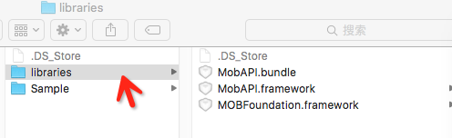
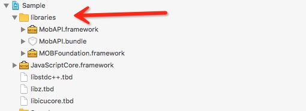
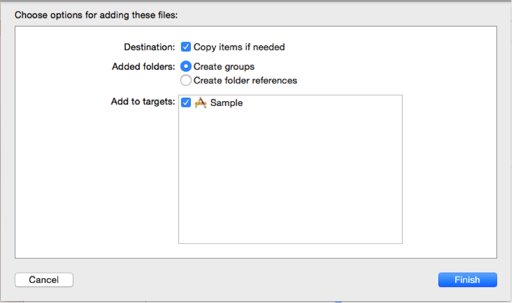
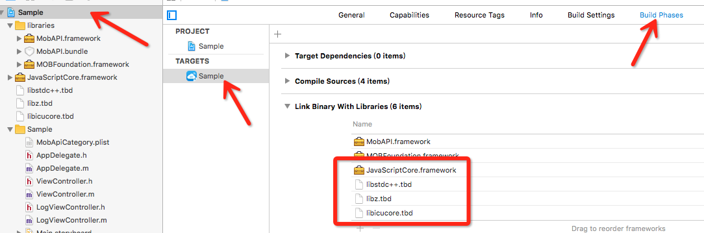

###一、获取AppKey
如何在我们的官网注册应用得到appkey，请点击链接看里面的操作步骤

[MobAPI 应用注册](http://api.mob.com/#/)

###二、下载SDK
请点击这里进去下载相应的sdk


[MobAPI 下载](http://www.mob.com/#/downloadDetail/mobAPI/ios)

###三、快速集成	

#### 手动导入

第一步：将下载的包中 libraries 下面所有的文件导入到您的工程中，见下图 




拖到工程中后弹出以下对话框，勾选”Copy items into destination group’s folder(if needed)”，并点击“Finish“按钮, 如图 


注意：请务必在上述步骤中选择“Create groups for any added folders”单选按钮组。如果你选择“Create folder references for any added folders”，一个蓝色的文件夹引用将被添加到项目并且将无法找到它的资源。

第二步：添加依赖库 添加步骤见下图 	



必须添加的依赖库如下(Xcode 7 下 *.dylib库后缀名更改为*.tbd)：

libicucore.dylib


libz.dylib


libstdc++.dylib


JavaScriptCore.framework

#### CocoaPods 导入 

只需要在 Podfile 里面加入这两句命令，pod install 即可：
	
	pod 'MobAPI-For-iOS'
	pod 'MOBFoundation'

	

###四、使用 MobAPI	

第一步：设置MobAPI 的Appkey并进行初始化，打开*AppDelegate.m(*代表你的工程名字)导入头文件


	 #import <MobAPI/MobAPI.h>	

	 
在- (BOOL)application: didFinishLaunchingWithOptions:方法中调用registerApp方法来初始化SDK

	- (BOOL)application:(UIApplication *)application didFinishLaunchingWithOptions:(NSDictionary *)launchOptions
	{
	    //替换您自己在Mob官网注册的App Key.注册地址[注册您要使用的sdk的app key]：http://dashboard.mob.com/#/
	    [MobAPI registerApp:@"14e2650055847"];
	    
	    return YES;
	}


第二步：添加实现代码，MobAPI 类中提供了一个sendRequest方法用于请求不同的功能接口，如查询手机号码归属地：


	[MobAPI sendRequest:[MOBAPhoneRequest ownershipRequestByPhone:@"13333333333"]
	                    onResult:^(MOBAResponse *response) {
	                        
	                        if (response.error)
	                        {
	                            NSLog(@"request error = %@", response.error);
	                        }
	                        else
	                        {
	                            NSLog(@"request success = %@", response.responder);
	                        }
	                        
	                    }];


注：使用不同的Request类对象来进行请求，可以请求不同功能的API，其中MOBARequest为请求基类，可以进行各种API的请求。对于其他Request类中未封装的请求可以使用基类进行。请求类功能对照表如下：

类型 | 功能 | 
------------ | ------------- 
MOBABankCardRequest | 银行卡信息查询 
MOBABoxOfficeRequest | 电影票房相关请求 
MOBACalendarRequest | 万年历查询 
MOBACarRequest | 汽车信息相关查询 
MOBACookRequest | 菜谱相关请求 
MOBADictionaryRequest | 新华字典查询 
MOBADomesticMetalRequest | 国内交易所贵金属数据相关请求 
MOBADreamRequest | 周公解梦查询 
MOBAEnvironmentRequest | 空气质量查询请求 
MOBAExchangeRequest | 全球货币汇率相关请求 
MOBAFlightRequest | 航班信息相关查询 
MOBAFootballLeagueRequest | 足球5大联赛信息相关查询 
MOBAGlobalStockRequest | 全球股指信息相关请求 
MOBAGoldRequest | 黄金价格相关请求 
MOBAHealthRequest | 健康知识查询 
MOBAHistoryRequest | 历史上的今天查询
MOBAHoroScopeRequest | 八字信息查询
MOBAIdiomRequest | 成语查询 
MOBAIdRequest | 身份证信息查询请求
MOBAIKTokenRequest | 词库分词相关查询 
MOBAIpRequest | 查询IP对应的省市区信息
MOBAKvRequest | k-v 存储相关操作 
MOBALaohuangliRequest | 老黄历信息查询
MOBALotteryRequest | 彩票开奖信息相关请求 
MOBAMarriageRequest | 婚姻匹配查询
MOBAMobileLuckyRequest | 手机号码查吉凶
MOBAPhoneRequest | 手机号相关请求 
MOBAPostcodeRequest | 邮编相关请求 
MOBAProvinceoilRequest | 今日各省油价相关请求 
MOBASilverRequest | 上海交易所白银数据相关请求 
MOBAStationRequest | 查询手机基站信息 
MOBATiKuRequest | 驾考题库相关查询 
MOBATrainTicketsRequest | 火车票相关查询 
MOBAUserCenterRequest | 用户系统相关请求 
MOBAWeatherRequest | 天气相关请求
MOBAWxArticleRequest | 微信精选相关请求 

